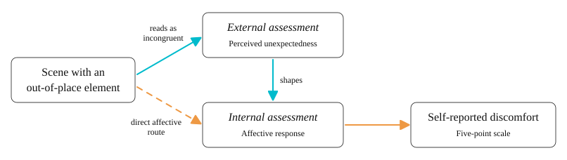

---
---

# Introduction

Humans are remarkably quick at understanding visual scenes. A brief glance is often enough to identify where we are, what is happening, and what to do next (Oliva & Torralba, 2007). This speed is not simply the result of the eye taking in shapes and colours; it depends heavily on what the observer already knows about the kind of environment they are looking at (Bar, 2004). Predictive coding frameworks account for this by proposing that the brain constantly generates expectations about what it is about to see and compares those expectations to the incoming image (Friston, 2010; Rao & Ballard, 1999). When the image matches what the brain expected, processing is fast and effortless. When it does not, the mismatch registers as a prediction error that the brain must resolve (Clark, 2013). Everyday visual experience, from recognising a café to navigating a crowded street, therefore rests on a foundation of learned regularities that make the familiar feel fluent and the unfamiliar feel effortful.

A growing body of work shows that when these expectations are violated, the violation carries a measurable perceptual cost: the scene takes longer to understand, is described less accurately, and is harder to detect at all. Greene et al. (2015) established this across three experiments using photographs of highly improbable real-world events, such as an underwater press conference, each matched to a probable counterpart on colour, spatial frequency, edge density, and semantic content. When observers wrote free descriptions of briefly presented scenes, descriptions of improbable scenes contained more errors and captured less of the depicted event. When presentation duration was varied and observers judged whether a scene was unusual, reliable detection of the improbability required exposure times far longer than ordinary scene categorisation demands. When images were embedded in visual noise, improbable scenes were detected less accurately than probable ones. Because the two image sets were matched on low-level features, these deficits could not be attributed to the stimuli themselves; Greene et al. concluded that rapid scene understanding depends critically on prior experience with real-world environments. The study is foundational to the present work because it demonstrates that contextual improbability can be manipulated as a property of a photograph while holding the visual signal constant, and that doing so reliably disrupts processing.

The neural evidence converges on the same conclusion. McLean et al. (2023) recorded event-related potentials while participants categorised scenes preceded by a valid or invalid contextual cue, and found that appropriate expectations facilitated gist processing while inappropriate expectations interfered with it. Congruency effects appeared in the P2, a component associated with the integration of visual properties, and in the later N400 and P600, components associated with semantic and syntactic coherence respectively, indicating that expectation violations are registered across early perceptual as well as later integrative stages of processing. Ruzzoli et al. (2020) found that surrealistic images containing object-scene incongruities triggered automatic conflict-detection signals even when observers were not asked to attend to the oddity, showing that the mismatch is registered without intent. Together these findings support a consistent conclusion: the visual system is tuned to the regularities of everyday environments, and encountering elements that violate those regularities disrupts processing in ways measurable both behaviourally and neurally.

What this literature has largely overlooked, however, is whether these expectation violations also change how a person feels. Studies in the predictive-coding tradition have focused on perceptual accuracy and processing time, treating violated expectations as a purely cognitive problem. Barrett and Bar (2009) challenged this framing by arguing that affective responses are generated alongside perceptual predictions rather than after them. On their account, the brain's predictions about incoming input are inherently valenced, such that stimuli that are difficult to reconcile with expectations are accompanied by negative feeling states before any deliberate evaluation takes place. Supporting this view, Sadeghi et al. (2024) showed that affective valence can be decoded directly from the visual features of scenes, and Caplette et al. (2020) found that expectation-driven activity in object-processing regions is modulated by the affective value of the anticipated objects. Together, these findings suggest that perceptual and affective prediction are intertwined rather than sequential processes.

Responses to environmental stimuli can be separated into two related but distinct processes, a distinction formalised in the conceptual framework advanced by Schreuder et al. (2016). External assessment is how the observer reads the environment itself: whether it looks expected, coherent, or orderly. Internal assessment is the emotional response the environment produces in the observer: whether it feels comfortable, uneasy, or pleasant. The two are coupled but not identical. The observer first registers what the environment is like, and then, either in parallel or in quick succession, responds to it emotionally in a way that is partly shaped by that initial reading. Schreuder et al. developed the framework through a review of experimental work on multisensory environments, in which sensory channels were combined either congruently or incongruently and participants reported their emotional state. Incongruent pairings, such as mismatched audio-visual or audio-olfactory combinations, tended to produce negative emotional appraisals, while congruent pairings produced positive ones. The authors interpreted this as evidence that the difficulty of the external reading feeds forward into the internal response: when an environment is harder to make sense of, the emotional response shifts in a negative direction.

Two features of this framework matter for the present study. First, applied to visual scenes it yields a specific and testable prediction: a scene containing out-of-place elements, being by definition harder to reconcile with expectations, should also be experienced as more uncomfortable, and the degree of perceived incongruence should track the degree of discomfort (Figure 1). Second, although the framework has been influential in multisensory environmental research, it has been developed and tested almost entirely in contexts involving combinations of sensory modalities. Its applicability to the unisensory visual case, and particularly to scenes in which visual incongruence is manipulated systematically while everything else is held constant, remains untested.

**Figure 1**  
*External and internal assessment applied to visual oddity*  
  
*Note.* Adapted from the two-process account of Schreuder et al. (2016). The solid path represents the prediction tested here, in which the perceived unexpectedness of a scene (external assessment) shapes the affective response to it (internal assessment). The dashed path represents a direct affective response not mediated by perceived unexpectedness.

The element being manipulated in such a design is best described as visual oddity: an object or event that is semantically or structurally out of place given the scene that contains it. Oddity so defined is a property of the relationship between an element and its context rather than of the element itself, since the same object that reads as incongruous in one setting is unremarkable in another where it is expected (Bar, 2004; Oliva & Torralba, 2007). Existing paradigms operationalise this relational property in different ways. Greene et al. (2015) used whole scenes depicting improbable events; Ruzzoli et al. (2020) used surrealistic compositions in which an object was substituted into a setting where it did not belong; McLean et al. (2023) manipulated congruence between a contextual cue and a subsequent scene category. What these paradigms share is the assumption that the observer holds a context-specific expectation that the stimulus then violates, and what they share equally is that the consequences measured have been perceptual and neural rather than affective.

Visual atypicality carries affective weight when the stimulus is a person as well as a place. Sasson et al. (2017) examined first impressions across several thin-slice paradigms, including a condition using only static photographs, and found that observers formed markedly less favourable impressions of autistic targets, rating them as less approachable and less likeable and reporting reduced willingness to interact. These judgments formed within seconds and persisted when audio and conversational content was removed, isolating visual presentation as sufficient to drive the effect, and held regardless of what the targets had actually said. The finding is relevant here because it shows the sequence Schreuder et al. (2016) describe operating on a purely visual stimulus and on a timescale too rapid for deliberate evaluation: the stimulus is read as atypical, and a negative affective response follows. What that paradigm could not establish is whether the affective response was driven by perceived unexpectedness itself, since social judgements recruit a great deal besides. Isolating that link in the simpler, non-social case is a prerequisite for asking the question in the social one.

Despite this convergence across scene perception, multisensory affect, and social cognition, no study has directly tested whether scene-level oddities of the kind used by Greene et al. (2015) produce measurable changes in self-reported discomfort, nor whether the perceived unexpectedness of a scene (reflecting external assessment) predicts the discomfort response (reflecting internal assessment). The present study addresses this gap by investigating the effect of visual oddity on perceived discomfort in everyday scenes and by testing whether perceived unexpectedness predicts the discomfort response.

## Significance of the Study

Theoretically, the study extends predictive coding accounts of scene perception (Friston, 2010; Rao & Ballard, 1999) beyond the perceptual and cognitive domains in which they have primarily been tested. If oddity scenes raise discomfort, and if unexpectedness tracks discomfort, this would offer direct empirical support for Barrett and Bar's (2009) proposal that affective and perceptual predictions are generated in concert rather than sequentially, and would provide the first test of Schreuder et al.'s (2016) external-internal assessment framework in the unisensory visual case.

Methodologically, the study introduces a scene-family design in which multiple variants of each everyday setting are constructed to orthogonally manipulate oddity and activity level. Holding the underlying environment constant across variants isolates the contribution of contextual incongruence to affective response, and treating oddity as relational rather than intrinsic means the manipulation can be applied to any setting for which a normative expectation exists.

## Aims and Hypotheses

The aim of this study is to investigate whether visual scenes containing contextually incongruent elements produce higher self-reported discomfort than scenes depicting expected situations, and whether perceived unexpectedness predicts the discomfort response. Testing this relationship provides a direct empirical evaluation of Schreuder et al.'s (2016) external-internal assessment framework within the visual-scene domain. The activity level of each scene, defined as the number of people and the degree of human activity present, is included as an additional factor in the design to control for the possibility that crowding independently influences discomfort, so that any observed differences in discomfort can be attributed to the presence of oddity rather than to the density of activity in the scene.

Three predictions follow. First, participants will report greater discomfort for scenes containing out-of-place elements than for scenes depicting expected situations, as measured on a five-point discomfort scale. This prediction follows from Greene et al.'s (2015) finding that improbable scenes disrupt processing, together with Barrett and Bar's (2009) argument that processing difficulty generates negative affect. Second, discomfort will not differ between busy and quiet scenes, and the increase in discomfort produced by oddity will hold at both levels of activity, consistent with the intended role of activity level as a control factor. Third, scenes containing out-of-place elements will be rated as more unexpected than their expected counterparts on a five-point unexpectedness scale, and scenes rated as more unexpected will be rated as more uncomfortable. This final prediction operationalises Schreuder et al.'s (2016) proposed link between external and internal assessment.
