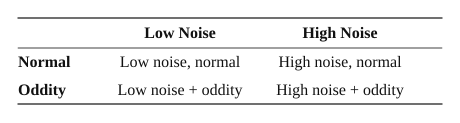
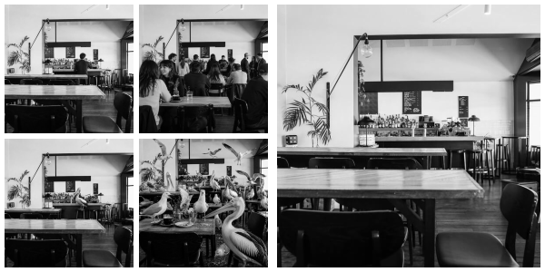
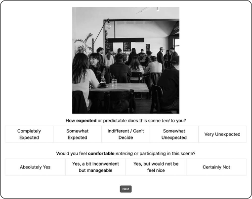

---
---

# Method

## Design

This study used a quantitative, cross-sectional, experimental design, delivered as an online task. A 2×2 within-subjects design was used, crossing noise (low vs. high) with oddity (normal vs. oddity). A within-subjects design was chosen so that every participant responded to every condition, which controls for individual differences in how people react to everyday scenes and makes the comparison between conditions more sensitive.

**Independent variables.** Two factors were manipulated within each participant, resulting in four total conditions (see Table 1 for the design and Figure 2 for an example scene family). Oddity refers to whether a scene contains an element that is out of place for its setting, with two levels: normal (every element fits the setting) and oddity (one or more elements are incongruent with the setting; for example, sea birds perched among the tables inside a café). Noise refers to how busy a scene is, with two levels: low (few subjects, little activity) and high (many subjects, lots of activity). Crowding and activity level are already known to influence how comfortable a person feels in a setting, independent of any oddity (Mavros et al., 2022; Mehrabian & Russell, 1974). Noise was therefore included as a factor in its own right so that its known influence could be separated from the effect of oddity, ensuring that any rise in discomfort linked to oddity was not simply the result of a scene being busier.

**Dependent variables.** Two self-report measures were collected for every scene, following Schreuder et al.'s (2016) distinction between external and internal assessment. *Perceived unexpectedness* (external assessment) captures how expected or predictable the scene looks to the viewer and was rated on a five-point scale. *Discomfort* (internal assessment) captures how uncomfortable the participant would feel in the scene and was rated on a four-point scale, scored so that higher values indicate greater discomfort. Exact item wording and response labels are reported in the Materials section. The central question tested is whether perceived unexpectedness predicts discomfort, linking the outward judgement of a scene to the inward emotional response.

**Table 1**  
*Experimental Conditions: Noise Level × Oddity*  
  
*Note.* Each cell represents one of the four within-subjects conditions. Every participant contributes responses to all four conditions.

## Participants

The final sample comprised 84 adults recruited through the Prolific online participant pool (prolific.com). Recruitment, screening, and reimbursement were managed within Prolific, and the experiment itself was hosted on the Gorilla Experiment Builder (app.gorilla.sc).

**Inclusion and exclusion criteria.** To take part, a person had to be 18 years or older, currently living in one of four majority English-speaking Western countries (Australia, Canada, the United Kingdom, or the United States), and able to read and understand English. Normal or corrected-to-normal vision was required, as the task is entirely visual. Participants had to complete the study on a desktop or laptop computer; mobile phones and tablets were excluded so that image size and display quality stayed consistent across the sample. A stable internet connection and a quiet, distraction-free setting were also required. To protect data quality, recruitment was further limited through Prolific's pre-screening filters to users with an approval rating of 99–100% and more than five previously completed submissions.

**Demographics.** Age, sex, and country of residence were drawn from participants' existing Prolific profiles. The final sample had a mean age of 40.87 years (*SD* = 12.86; *Mdn* = 39, IQR = 19, range 18–69) and comprised 45 women and 39 men.

**Condition allocation.** As the design was within-subjects, every participant completed all four conditions; there were no separate groups. Scene-to-condition assignment is described in the Procedure.

**Sample size.** The target sample size was set using an a priori power analysis in G*Power 3.1 (Faul et al., 2007). Because the mediation was estimated within a regression framework, power was calculated for a linear multiple regression (fixed model, R² increase) with three tested predictors out of three total (oddity, perceived unexpectedness, and noise). Assuming a medium effect size (f² = 0.15), an alpha of .05, and power of .80, the analysis indicated a minimum of 77 participants, *F*(3, 73) = 2.73, λ = 11.55, achieved power = .80. To allow for incomplete or low-quality responses, recruitment aimed for approximately 85 participants (a 10% buffer). Eighty-seven were recruited; exclusions reduced the final sample to 84, marginally short of the buffered target but comfortably above the required minimum of 77. This calculation is denominated in participants, whereas the mediation was fitted to the pooled set of individual ratings (see Data Analysis); it therefore establishes the recruitment target rather than describing the degrees of freedom of the model as estimated.

**Ethics and consent.** The study was approved by the UNSW Human Research Ethics Advisory Panel (HREAP-C: Behavioural Sciences; iRECS #11595) prior to recruitment. As an anonymous online experiment, it used implied consent: after viewing the Participant Information Statement (also provided as a downloadable PDF), participants consented by clicking to continue into the task. Participants could withdraw at any time by closing the browser. The study was administered as one component of a combined battery of six honours studies, run in a single session by the candidates in the same cohort; participants were reimbursed through Prolific at a flat rate of USD $12.00 for completing the battery as a whole, rather than for this study individually.

## Materials

**Stimuli.** The stimulus set consisted of 64 images, organised into 16 scene families. Each family showed one everyday setting (for example, an English pub, or a subway platform) in four versions, one per condition: low-noise/normal, high-noise/normal, low-noise/oddity, and high-noise/oddity. The full set, with individual source credits and the exact editing prompt used for each image, is provided in Appendix A; one example family is shown in Figure 2.

**Figure 2**  
*Example Scene Family Across the Four Experimental Conditions*  
 
*Note.* Top row: normal (no oddity); bottom row: oddity added. Left column: low noise; right column: high noise. All four versions were generated from a single base photograph (right most). The complete stimulus set appears in Appendix A.

Each family started from a single neutral base photograph (an empty scene with no subjects and no out-of-place objects) sourced from royalty-free image libraries such as Pixabay and Pexels, whose licences permit modification and redistribution. These base photographs were not shown to participants; they served only as the base image. The four versions of each scene were then generated from that image using the image-generation tools in ChatGPT, model GPT-5 (OpenAI, 2026). Building all four versions from one base image was a deliberate choice: it held the setting, layout, and lighting constant across conditions, so that the only things that varied were the level of activity (noise) and the presence of an out-of-place element (oddity). Because low-level visual features such as colour and layout shape how scenes are perceived (Berman et al., 2014), holding the base image constant helps ensure that any difference in ratings reflects the manipulation rather than incidental differences between images.

Each version was produced by a separate prompt applied to the same base photograph. For the English pub family, for example, the low-noise/normal version used "Can you create an image that populates the attached image with a single bartender and a single patron", while the matching high-noise/oddity version used "I now need to create an image that depicts an oddity, but also introduces noise ... populate the bar space with sheep and goats. The animals should be depicted in natural positions". The complete set of 64 prompts, paired with the image each produced, is listed in Appendix A.

The editing prompts were written to avoid two confounds. Depicted people were kept neutral, with no provocative imagery, so that ratings would not be coloured by appearance-based reactions. Oddities were chosen to be unusual but harmless (for example, a grand piano on a beach, or a pelican in a café), avoiding anything frightening or dangerous. This constraint was applied because threatening content drives negative scene judgements in its own right (Damiano et al., 2021), and using harmless oddities keeps the focus on incongruity rather than fear.

**Measures.** Two single-item measures appeared beneath each image. Perceived unexpectedness (external assessment) used the item "How expected or predictable does this scene feel to you?", rated on a five-point scale (Completely Expected, Somewhat Expected, Indifferent / Can't Decide, Somewhat Unexpected, Very Unexpected). Discomfort (internal assessment) used the item "Would you feel comfortable entering or participating in this scene?", rated on a four-point scale (Absolutely Yes; Yes, a bit inconvenient but manageable; Yes, but would not feel nice; Certainly Not). Responses were scored 1 to 4 in the order listed, so that higher values indicate greater discomfort. The scale deliberately omits a neutral midpoint, requiring participants to lean either toward or away from comfort.

Both items were written for this study rather than taken from a published instrument, so established reliability and validity statistics are not available. Their content validity rests on the external/internal assessment framework (Schreuder et al., 2016), and brief single-item ratings of this kind suit rapid, scene-by-scene judgements. As single items, they cannot be assessed for internal-consistency reliability, which is acknowledged as a limitation.

## Procedure

After accepting the study on Prolific, participants clicked a link that opened the experiment in their web browser on the Gorilla Experiment Builder, viewed the Participant Information Statement, and gave consent by clicking to continue.

Participants then saw an instruction screen that asked them to look at each scene briefly and answer on first impression rather than over-thinking, and explained how to use the two rating scales - including that the neutral "Indifferent / Can't Decide" option on the unexpectedness scale should be used only when they genuinely could not lean either way, and that the discomfort item should be answered by imagining they were actually there. The screen also warned that they could not return to a previous image. Finally, it disclosed that the images were photographs of real places that had been altered using AI, and asked participants to set the alterations aside and respond as though viewing a genuine, unedited everyday scene.

The main task followed and consisted of 32 trials. On each trial, one scene image was displayed with the two questions beneath it: first the unexpectedness question (five-point scale) and then the discomfort question (four-point scale), as shown in Figure 3. A response to both items was required: the task would not advance until each had been answered, so no trial could be skipped or left partially complete. After answering both, the participant clicked "Next" to advance. No time limit was set, and participants could not go back to change earlier responses. Participants who did not wish to answer remained free to withdraw at any point by closing the browser, as stated in the Participant Information Statement.

**Figure 3**  
*Layout of a Single Trial Screen*  
  
*Note.* Each trial presented one scene image with the perceived unexpectedness item (five-point scale) above the discomfort item (four-point scale). Both items required a response before the "Next" button would advance the task, and participants could not return to a previous trial.

Images were selected and ordered by a custom randomisation script written for Gorilla (see Appendix B). One run of the script produced a block of 16 trials: a Fisher–Yates shuffle randomised the order of the 16 scene families, and a second Fisher–Yates shuffle drew conditions from a fixed pool containing each of the four conditions exactly four times, so that every family appeared once and each condition appeared four times within the block. The script was run twice per participant, giving 32 trials in total and a balanced eight images per condition.

Because the two runs were independent, each scene family was seen exactly twice by every participant, but the condition it appeared in on the second run was drawn without reference to the first. A family could therefore repeat in the same condition or appear in a different one; across the sample, 24.0% of repeated families fell in the same condition, closely matching the 25% expected by chance. Presentation order and scene-to-condition pairing were random and unique to each person, which spread every scene family across all four conditions at the sample level. The repetition is noted as a limitation, since a second exposure to a familiar setting may attenuate its perceived unexpectedness.

The task was deliberately short to limit fatigue. The 32-trial rating block took a median of 5 minutes 09 seconds to complete (IQR = 2 min 17 s, range 2 min 11 s to 15 min 19 s), and the full session, including the Participant Information Statement, instructions, and demographic items, was advertised on Prolific as approximately 10 minutes. Because all study information was provided up front, there was no separate end-of-study debrief.

## Data Analysis

All analyses were conducted in IBM SPSS Statistics (Version 31.0.1.0 (49)). Each rating was converted to a numeric score: discomfort from 1 to 4 and perceived unexpectedness from 1 to 5, coded so that higher scores indicated greater discomfort and greater unexpectedness, respectively. Oddity (0 = none, 1 = present) and noise (0 = low, 1 = high) were dummy-coded.

Of the 87 participants recruited, three were excluded before analysis. Two returned no usable data, their submissions having not been fully processed by the platform, and one was excluded for inattentive responding. As noted above, this study formed part of a combined battery of six honours studies, and the participant in question failed four of the five attention checks embedded in the other studies in that battery; the present task carried no attention check of its own, as its design did not involve reaction-time measurement, so the judgement was made on the cohort-wide record. This left a final analysed sample of 84 participants contributing 2,688 ratings (84 × 32). Because both items required a response before the task would advance, the retained sessions contained no missing item-level data, and no ratings were lost to partial completion.

Each participant contributed eight ratings in each of the four conditions, or 32 ratings in total. These ratings were de-identified and pooled into a single dataset, so that each row represented one scene rating rather than one person, and the regression was run across all ratings combined. This kept the dataset simple and protected participant anonymity. One trade-off is that the analysis treated each rating as if it came from a different source, even though a single participant's ratings tend to be similar to one another, and each participant rated every scene family twice. This is acknowledged as a limitation of the pooled approach.

The research question had two parts: whether oddity raised discomfort, and whether that effect worked through how unexpected the scene felt. This was tested with a mediation analysis, in which oddity was the predictor, discomfort was the outcome, and perceived unexpectedness was the mediator (the step in between). This followed Schreuder et al.'s (2016) external-to-internal pathway: an out-of-place scene is first judged as unexpected, and that unexpectedness in turn raises how uncomfortable a person feels. The analysis tested both the direct link from oddity to discomfort and the indirect link running through unexpectedness. Noise was included as a control variable, so that its influence was held constant and could not be mistaken for an effect of oddity.

Mediation was tested using the PROCESS macro, Version 4.2 beta (Hayes, 2017), with 10,000 bootstrap samples and 95% confidence intervals. The indirect (mediated) effect was treated as meaningful when its confidence interval did not include zero. Standard assumptions (linearity, normally distributed residuals, equal spread of residuals, and low overlap between predictors) were checked, the rating scales were treated as approximately continuous (a recognised simplification), and effects were judged at an alpha of .05.
