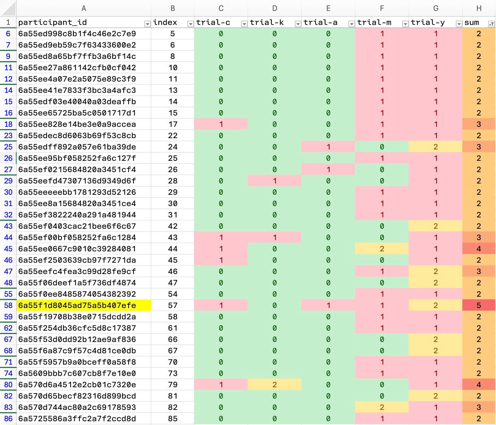

# Gorilla (app.gorilla.sc) Data export and Clean

---

## 1 - Files received from Gorilla™

- Trial was run 14 June - 15 June 2026
- Trail was run in combination with 6 other honours trails as a batch.
- 87 participants were recruited in total, and paid US$12/ea for participation
    - 2 participants were excluded from analysis for their data not being completely processed by the system (i.e. they were paid but we didn't get their data)
    - 1 participant was rejected for not completing all the tasks with due diligence.

        

        - Participant 74, with id `6a55f1d8045ad75a5b407efe` was selected for exclusion in the data.
        - Was rejected due to perceived inattention in the the other trails - of which pp 74 failed 4 of the 5. *(This trial was not tested for attention as the design did not include reaction testing.)* Participants responses where judged to not be reliable by the cohort.

- Two files received:
    - [`data_ODDITY_exp_274266-v20_task-8m3r.original.csv`](data/data/data_ODDITY_exp_274266-v20_task-8m3r.original.csv) - contains the trial run raw output for this trial.
    - [`data_DEMOGRAPHIC_exp_274266-v20_task-fw7d.original.csv`](data/data/data_DEMOGRAPHIC_exp_274266-v20_task-fw7d.original.csv) - contains demographic data questions asked with the 6 trails cohort group trail run.

---

## 2 - Data cleansing

- Two [Python](https://www.python.org/) *(version 3.14.3)* scripts were create to parse the raw data.  *(Data was given as event rows and specific trial data was not workable - the code consolidates each distinct question into one data row.)*

    - [demographics.py](source/demographics.py) - This code extracts the demographic data needed for <u>this</u> trial, i.e. `time_zone`, `age`, `gender`

        - Usage: `python3 demographics.py <input.csv> <output.csv>`

    - [clean.py](source/clean.py) - This code extract the trail data into 1 row data points for each of the trail input screens. Further more, for each row it:

        - Usage: `python3 clean.py <input.csv> <demographics.csv> <output.csv>`
        - Adds the demographic data for the specific participant.
        - Adds the Propensity personality trait asked as the last question in this trail.
        - Pre-codify the data columns that would otherwise be done in SPSS as "Variable Properties". *(It was decided that doing it at import would make for quicker SPSS analysis runs.)*
            - `expectedness` → `c_expect`
            - `comfortable`  → `c_discom`
            - `noisiness`  → `c_noise`
            - `oddity`  → `c_oddity`
            - `propensity`  → `c_propen`
            - `c_oddnse` - is calculated from the logic `c_noise && c_oddity`

- To generate the working data file, follow the following 1 steps.
    
    1. Command line:

        ```sh
        python3 source/demographics.py \
            data/data_DEMOGRAPHIC_exp_274266-v20_task-fw7d.original.csv \
            data/demographics.csv
        ```

        This creates the [demographics.csv](data/demographics.csv) file.

    2. Command line:

        ```sh
        python3 source/clean.py \
            data/data_ODDITY_exp_274266-v20_task-8m3r.original.csv \ 
            data/demographics.csv \ 
            data/data_ODDITY_exp_274266-v20_task-8m3r.clean.csv
        ```

        This creates the [data_ODDITY_exp_274266-v20_task-8m3r.clean.csv](data/data_ODDITY_exp_274266-v20_task-8m3r.clean.csv)

- ..which can then be used to import into SPSS or Excel.
