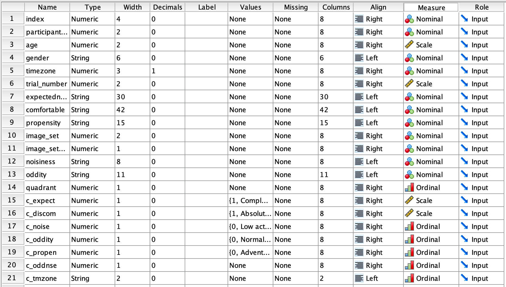
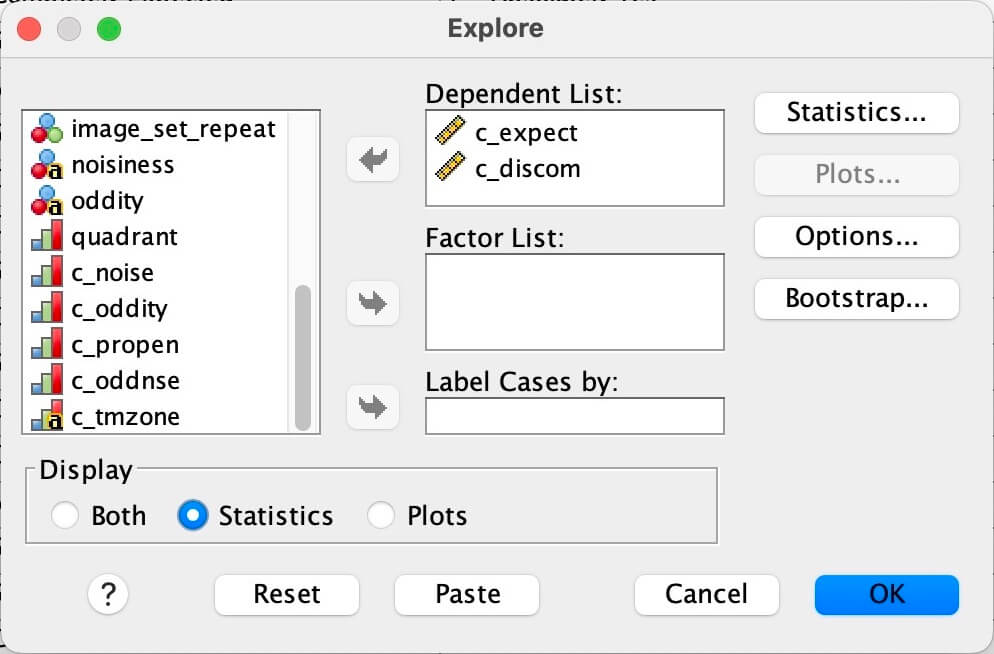
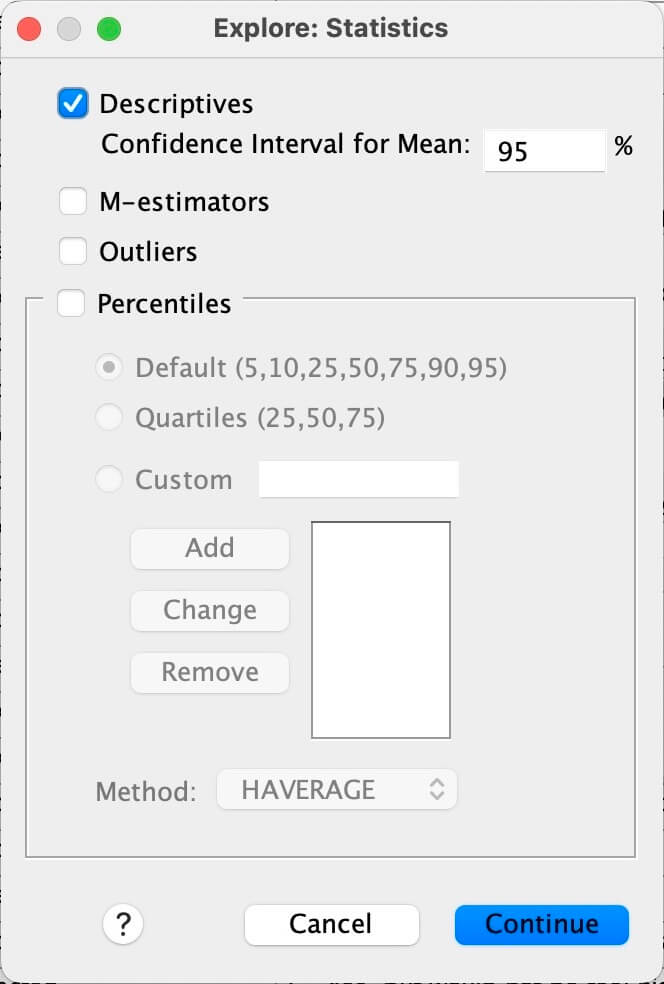
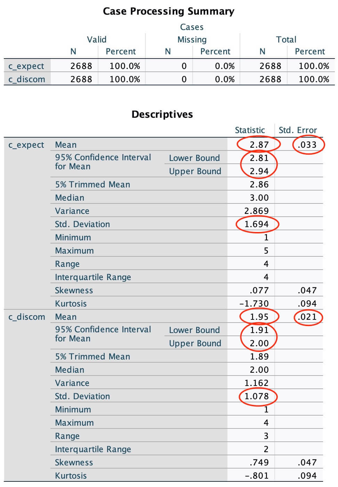
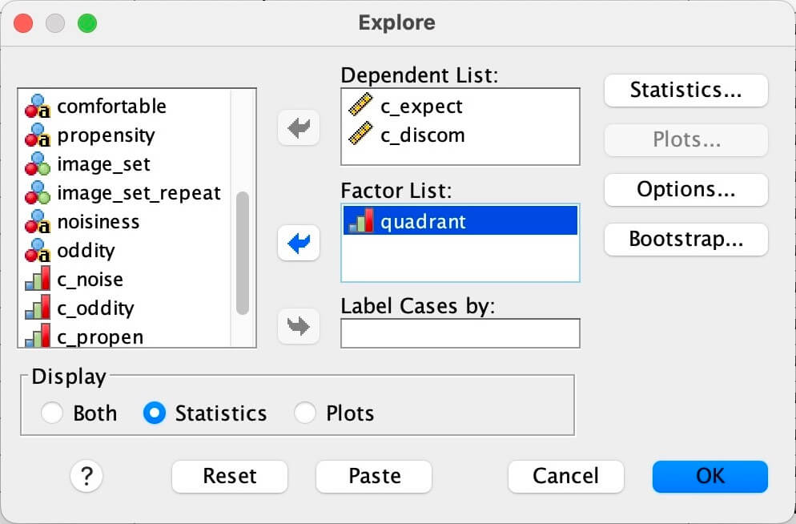
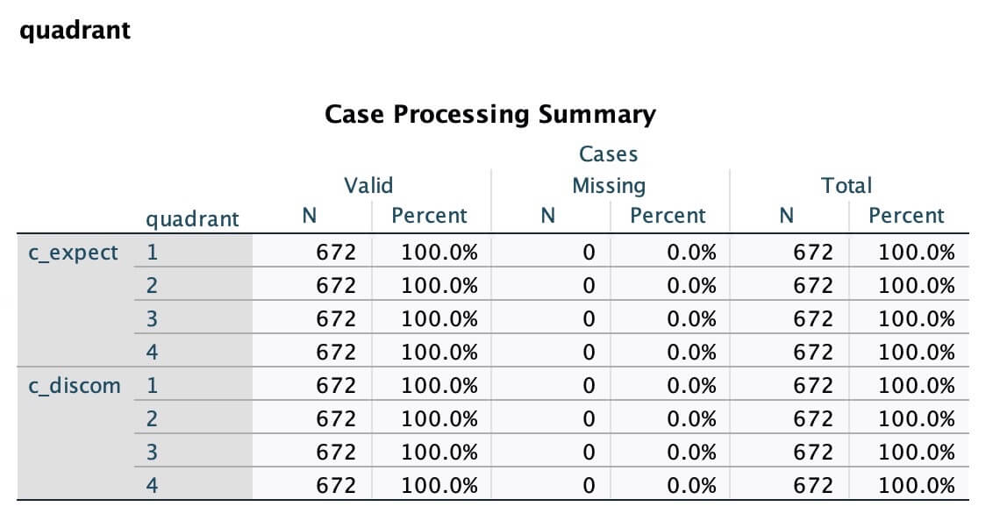
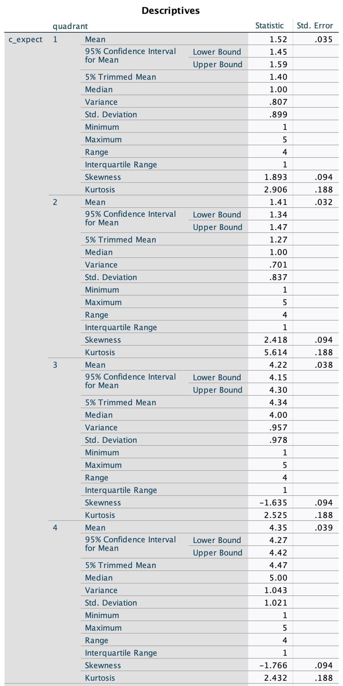
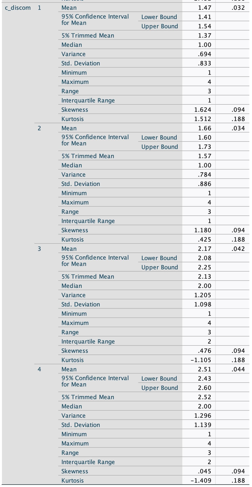
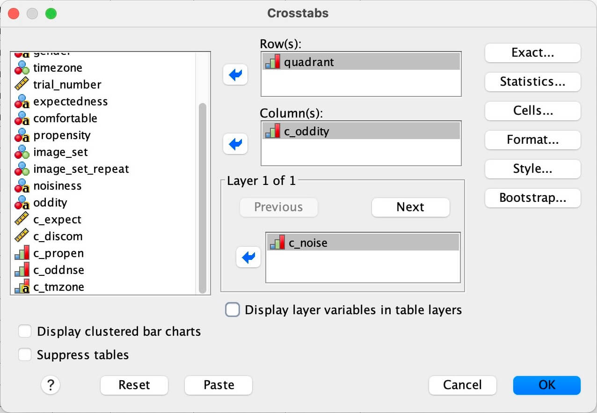
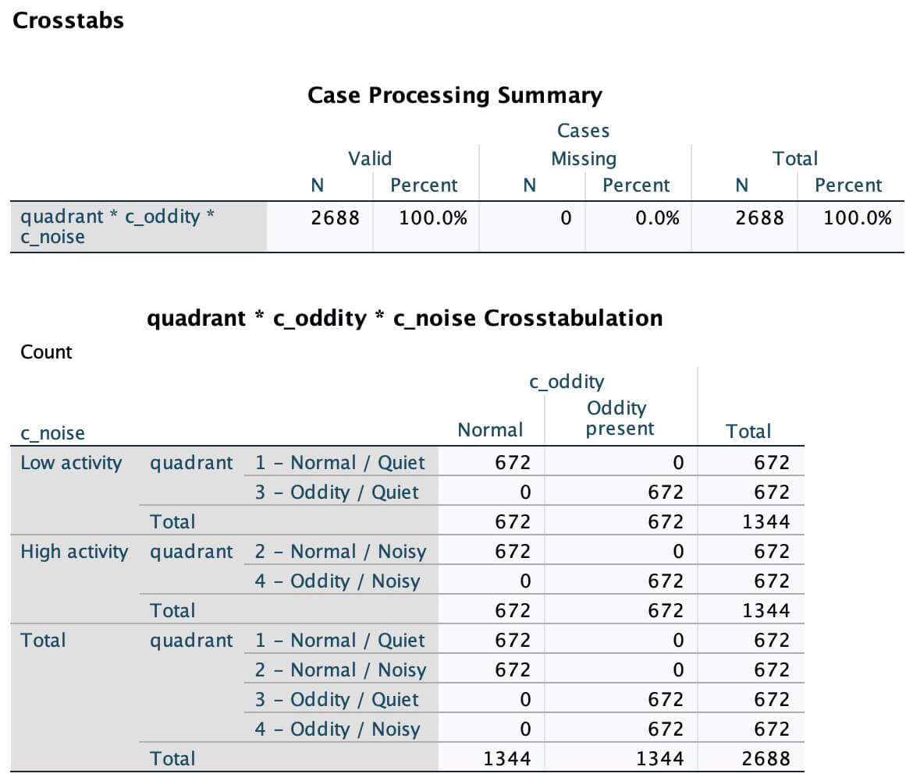

# IBM SPSS Statistics - Descriptive Statistics

> Version used: Version 31.0.1.0 (49)

---

## 1 - Load data

- Menu: `File → Import Data → CSV Data...'

- Select `data_ODDITY_exp_274266-v20_task-8m3r.clean.csv`

- Loaded data should import without issues

- Then select `Variable View` (bottom of page)

    ... and adjust "Values" and "Measure" of the following fields:

        - `c_expect`
        - `c_discom`
        - `c_noise`
        - `c_oddity`
        - `c_propen`
        - `c_oddnse`
        - `c_tmzone`

    

    (These are the coded columns we will use in the analysis.)

---

## 2 - Explore general statistics

- Menu: `Analyse → Descriptive Statistics → Explore`

- In dialog, select:

    - Dependent List: `c_expect`, `c_discom`
    - Factor List: *(empty)*
    - Display: **Statistics** (radio, bottom left)

        

    - Press the `Statistics...` button

        - Statistics: Tick **Descriptives**, Confidence Interval for Mean: **95%**

            

    - Continue → OK

    - Result will be:

        

---

## 3 - Explore quadrant statistics

- Menu: `Analyse → Descriptive Statistics → Explore`

- Same as before, then:

    - Factor List: `quadrant`

        

    - OK

    - Result will be:

        
        
        

---

## 4 - What to read from the Descriptives table, per variable and per cell:

### Quadrants

| | Low Noise | High Noise |
|---|:---:|:---:|
| No Oddity | 1 | 2 |
| Oddity present | 3 | 4 |

### Expectedness

| SPSS row | Reports as | All Data | Quadrant 1 | Quadrant 2 | Quadrant 3 | Quadrant 4 |
|---|:---:|:---:|:---:|:---:|:---:|:---:|
| Mean | *M* | 2.87  | 1.52 | 1.41 | 4.22 | 4.35 |
| Mean → Std. Error | *SE* | .003  | .035 | .032 | .038 | .039 |
| 95% Confidence Interval for Mean → Lower/Upper Bound | 95% CI | [2.81, 2.94] | [1.45, 1.59] | [1.24, 1.47] | [4.15, 4.30] | [4.27, 4.47] |
| Std. Deviation | *SD* | 1.694  | .899 | .837 | .978 | 1.021 |

### Discomfort

| SPSS row | Reports as | All Data | Quadrant 1 | Quadrant 2 | Quadrant 3 | Quadrant 4 |
|---|:---:|:---:|:---:|:---:|:---:|:---:|
| Mean | *M* | 1.95 | 1.47 | 1.66 | 2.17 | 2.51 |
| Mean → Std. Error | *SE* | .021 | .032 | .034 | .042 | .044 |
| 95% Confidence Interval for Mean → Lower/Upper Bound | 95% CI | []1.91, 2.00] | [1.41, 1.54] | [1.60, 1.73] | [2.08, 2.25] | [2.43, 2.60] |
| Std. Deviation | *SD* | 1.078 | .883 | .886 | 1.098 | 1.139 |

---

## 5 - Participant analysis

> Inferred from experiment design, but to confirm validity of data ...

- Menu: `Analyse → Descriptive Statistics → Crosstabs...`

- In dialog, select:

    - Row(s): `quadrant`
    - Column(s): `c_oddity`
    - Layer 1 of 1: `c_noise`

    

- OK

- Result will be:

    

    - Everything checks out structurally: 2688 valid, 0 missing, 672 per cell.
    - *N* = 84 participants, 2688 ratings (672 per quadrant cell, or 32 per participant).
    - The CIs Explore gives you are computed across all 2688 rows as if independent, so they're narrower than the true participant-level uncertainty.

---

## 6 - Summary

| | *M* | *SE* | 95% CI | *SD* | Range |
|---|---|---|---|---|---|
| Unexpectedness | 2.87 | 0.03 | [2.81, 2.94] | 1.69 | 1–5 |
| Discomfort | 1.95 | 0.02 | [1.91, 2.00] | 1.08 | 1–4 |

**By condition (n = 672 ratings per cell)**

| Condition | Unexpectedness *M* (*SD*) | 95% CI | Discomfort *M* (*SD*) | 95% CI |
|---|---|---|---|---|
| Normal / low activity | 1.52 (0.90) | [1.45, 1.59] | 1.47 (0.83) | [1.41, 1.54] |
| Normal / high activity | 1.41 (0.84) | [1.34, 1.47] | 1.66 (0.89) | [1.60, 1.73] |
| Oddity / low activity | 4.22 (0.98) | [4.15, 4.30] | 2.17 (1.10) | [2.08, 2.25] |
| Oddity / high activity | 4.35 (1.02) | [4.27, 4.42] | 2.51 (1.14) | [2.43, 2.60] |

**The manipulation worked, emphatically.** Unexpectedness marginals are 1.47 (normal) vs 4.29 (oddity) — a gap of 2.8 scale points, roughly 2.9 *SD*. Path *a* will be large. Discomfort marginals are 1.57 vs 2.34, so H1 is heading the right way (positive, ≈ 0.72 *SD*).

**H2 looks unlikely to hold.** Noise raises discomfort in both halves → +0.19 under normal, +0.34 under oddity - and with 672 per cell those gaps are well outside the CIs. Both a main effect of noise and possibly the interaction may come out significant. That isn't a problem for the study; it just means the "noise as inert control" framing is inaccurate. 

| Condition | Unexpectedness *M* (*SD*) | 95% CI | Discomfort *M* (*SD*) | 95% CI |
|---|---|---|---|---|
| Normal / Quiet | 1.52 (0.90) | [1.45, 1.59] | 1.47 (0.83) | [1.41, 1.54] |
| Normal / Noisy | 4.22 (0.98) | [4.15, 4.30] | 2.17 (1.10) | [2.08, 2.25] |
| Oddity / Quiet | 1.41 (0.84) | [1.34, 1.47] | 1.66 (0.89) | [1.60, 1.73] |
| Oddity / Noisy | 4.35 (1.02) | [4.27, 4.42] | 2.51 (1.14) | [2.43, 2.60] |

Of note! Unexpectedness tracks **noise** a lot more than **oddity**: quiet scenes average ~1.5 and noisy scenes ~4.3. Discomfort likewise rises mainly with noise (1.47 → 2.17 and 1.66 → 2.51) with a smaller oddity increment.

---
