# IBM SPSS Statistics - Hypothesis 1 and 2 Statistics

> Version used: Version 31.0.1.0 (49)

---

> - **H1** → *<u>Oddity lowers comfort</u>* - Scenes containing an out-of-place element will be rated significantly less comfortable (higher = more discomfort)
than normal scenes.
>
>    2 × 2 ANOVA via multiple regression
>
> - **H2** → *<u>Noise is inert</u>* - The main effect of noise and the noise × oddity interaction will both be non-significant, confirming noise as a control factor.
>
>     Same regression, Model 2
>

---

## Confirm the interaction term

- We designed the experiment to be balanced - but to make sure: `c_oddnse` is the logical product of `c_oddity` **`and`** `c_noise`, so no Compute field in SPSS is needed.

- Menu: `Analyse → Descriptive Statistics → Frequencies`

- In dialog, select:

    - Variable: `c_oddnse`

    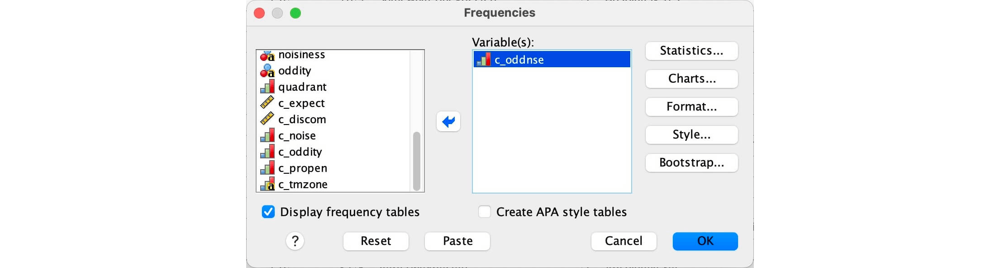

- OK

- It should show exactly two values, 0 (n = 2016) and 1 (n = 672).

    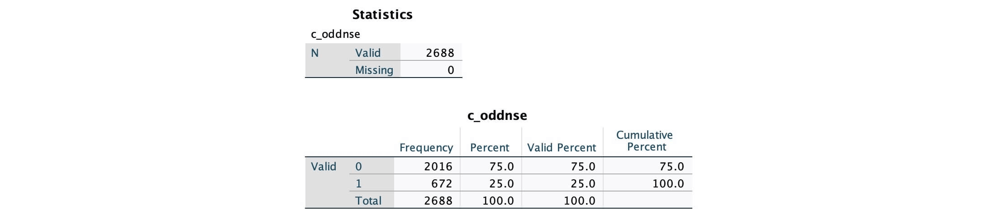

    - It does.

---

## The regression 

- One regression with three predictors gives both H1 and H1.

- Menu: `Analyse → Regression → Linear`

- In dialog, select:

    - Dependent: `c_discom`
    - Independent(s): `c_oddity`, `c_noise`, `c_oddnse` (all three in **Block 1**, Method: **Enter**)

    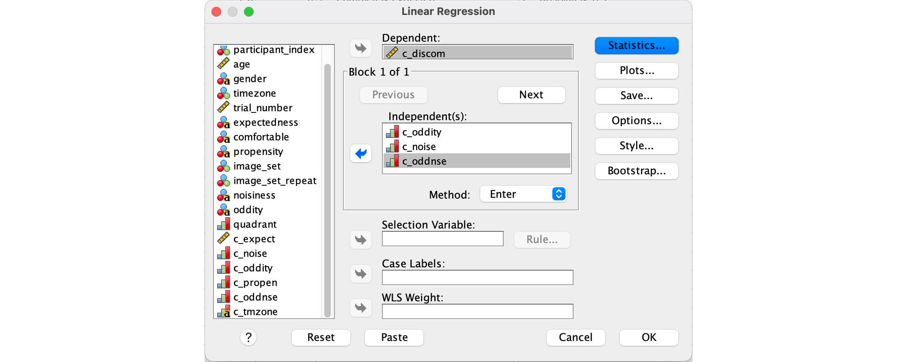

- Click on **Statistics** button, then select (tick):

    - Regression Coefficients
        - Estimates
        - Confidence intervals → (Level(%): `95`%)
    - Model fit
    - R squared change
    - Descriptives
    - Part and partial correlations
    - Collinearity diagnostics
    - Residuals:
        - Durbin-Watson
        - Casewise diagnostics → (Outliers outside: `3` SD)
   
    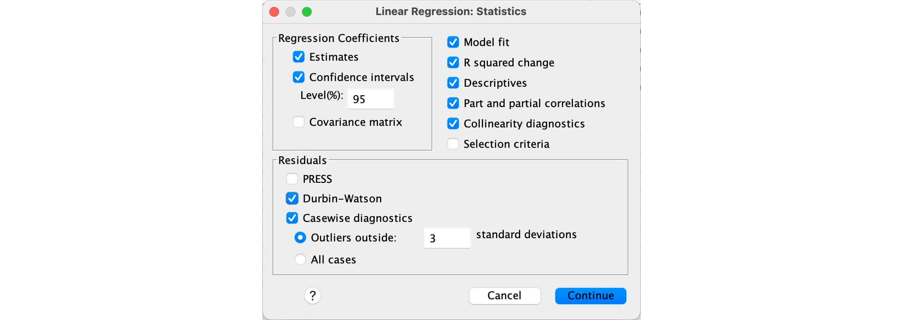

- Continue (to get back to Linear Regression dialog)

- Click on **Plots** button, then select:
    - Y: `*ZRESID`
    - X: `*ZPRED`
    - Standardized Residual Plots:
        - Histogram
        -  Normal probability plot

    

- Continue (to get back to Linear Regression dialog)

- Click on **Save** button, then select:
    - Distances:
        - Mahalanobis
        - Cook's
        - Leverage values

    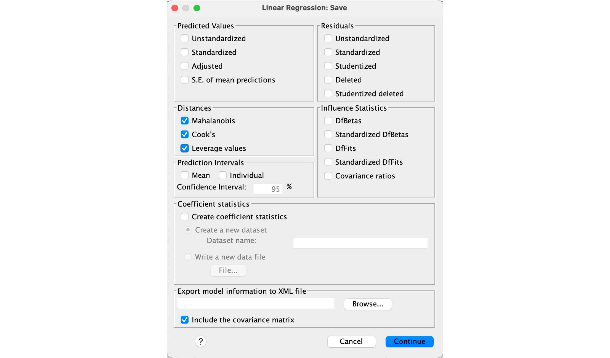

- Continue → and then, **OK**

---

## Results

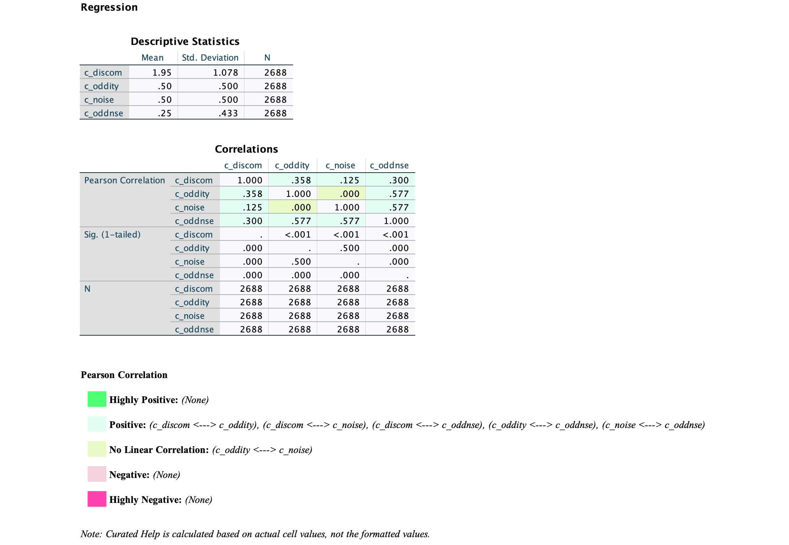
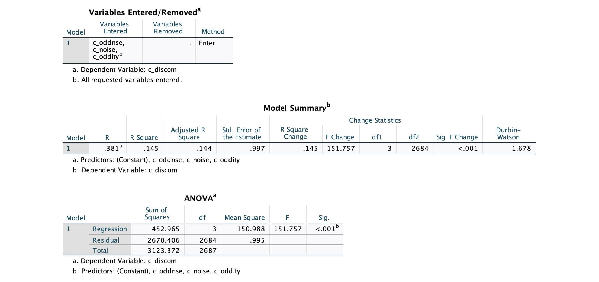
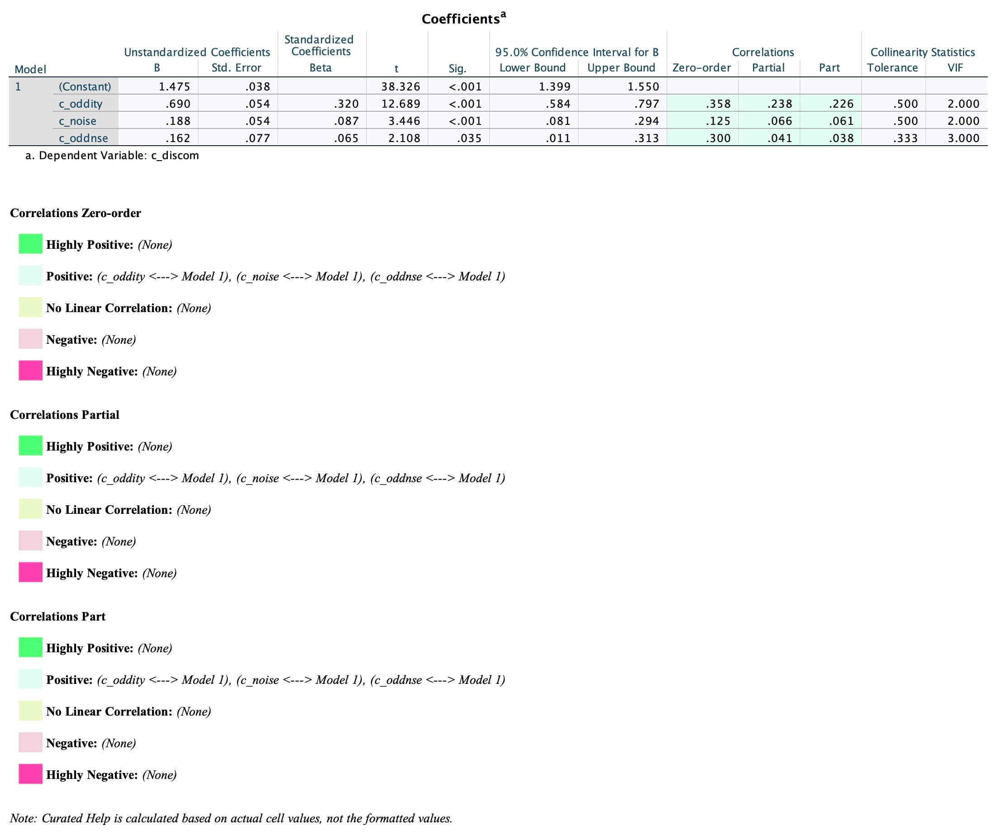
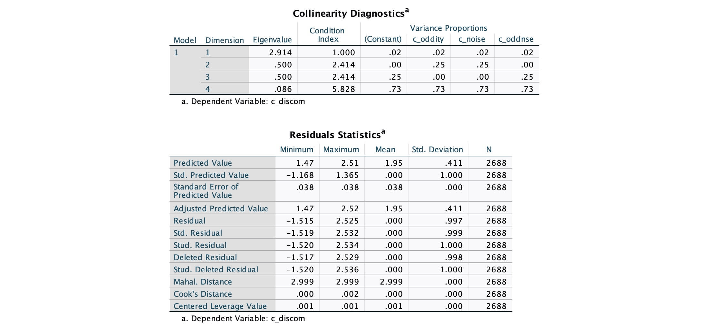
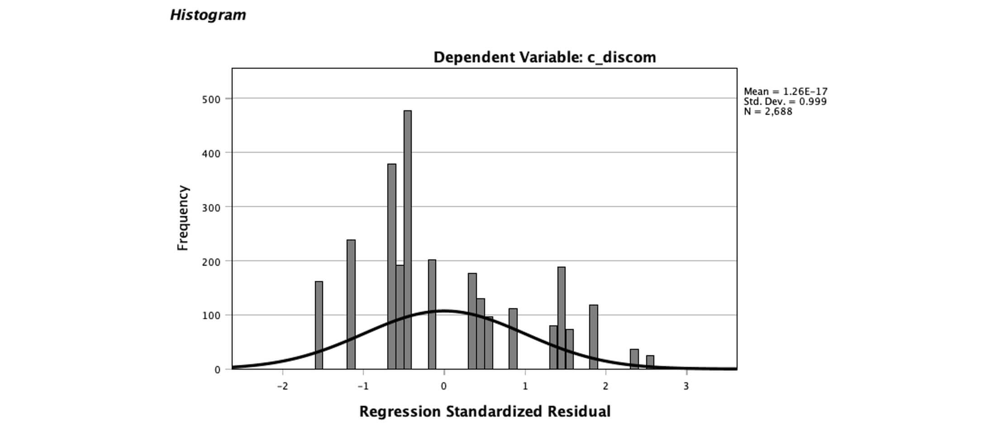
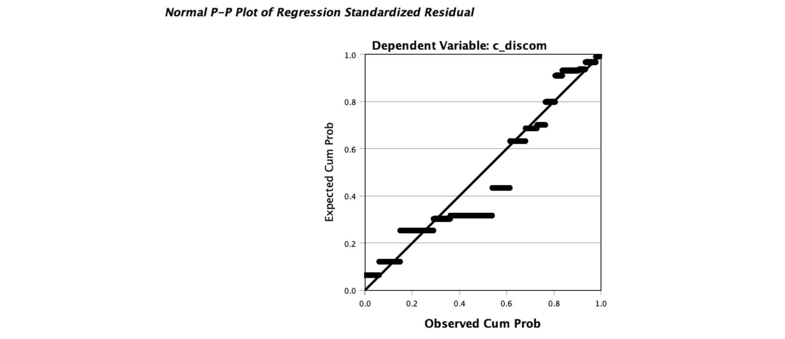
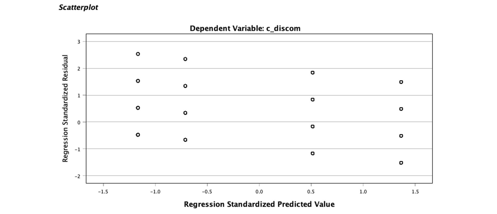

- What to read

| Output table | Row / column | Reports as |
|---|---|---|
| Model Summary | R Square, Adjusted R Square, Durbin-Watson | *R*², adj. *R*², DW |
| ANOVA | F, df1 (Regression), df2 (Residual), Sig. | *F*(3, 2684), *p* |
| Coefficients | `c_oddity` → B, Std. Error, Beta, t, Sig. | **H1** |
| Coefficients | `c_noise` and `c_oddnse` → same columns | **H2** |
| Coefficients | Part correlation (square it) | *sr*² |
| Coefficients | 95% CI Lower/Upper | CI on *b* |
| Coefficients | Tolerance / VIF | multicollinearity |

- A note on the **coefficients**: With both factors dummy-coded 0/1 and an interaction present, the terms are *simple* effects, not main effects:

    - **Constant** = predicted discomfort for Normal / Quiet (the 0,0 cell)
    - **`c_oddity`** = effect of oddity **when noise = 0**, i.e. quiet scenes only
    - **`c_noise`** = effect of noise **when oddity = 0**, i.e. normal scenes only
    - **`c_oddnse`** = how much the oddity effect changes when noise is present

---

## The results

### **Overall model**

*F*(3, 2684) = 151.76, *p* < .001, *R*² = .145, adjusted *R*² = .144. Cohen's *f*² = .17 (medium).

**Coefficients**

| Term | *b* | *SE* | 95% CI | β | *t* | *p* | *sr*² |
|---|---|---|---|---|---|---|---|
| Constant | 1.475 | .038 | [1.399, 1.550] | — | 38.33 | <.001 | — |
| Oddity | 0.690 | .054 | [0.584, 0.797] | .320 | 12.69 | **<.001** | .051 |
| Noise | 0.188 | .054 | [0.081, 0.294] | .087 | 3.45 | <.001 | .004 |
| Oddity × Noise | 0.162 | .077 | [0.011, 0.313] | .065 | 2.11 | .035 | .001 |

*sr*² = the Part correlation squared.


### H1 → *Oddity lowers comfort*

- **H1 is supported.** Oddity raises discomfort by 0.69 scale points, positive and significant, CI well clear of zero. On a 1–4 scale with *SD* = 1.08 that's ≈ 0.64 *SD* - a moderate effect, and by far the largest term in the model (*sr*² = .051 versus .004 and .001).

- Because the interaction is significant, that 0.69 is the **simple effect in quiet scenes**. In noisy scenes it's 0.690 + 0.162 = **0.85**. 

- Oddity increases discomfort under both conditions, so H1 holds regardless of noise level - the interaction only sharpens the effect.

- **Diagnostics**:

    - Max Cook's distance = .002, max leverage = .001, max |std. residual| = 2.53. No casewise diagnostics table printed, meaning nothing exceeded ±3.
    
    - Mahalanobis is a constant 2.999 for every case. That's structural: with three dummy predictors and only four design cells, every case sits at one of four identical points in predictor space. (No need to report.)

    - VIF 2.0 / 3.0, tolerance .50 / .33 - expected for a product of two dummies, all within limits. Condition index 5.83, fine.

    - Durbin–Watson 1.678. Below the ideal 2, reflecting the 32-ratings-per-participant clustering, not a modelling error.

<!-- 
- **APA sentence**:

```md
A 2 × 2 factorial ANOVA conducted via multiple regression examined the effects of oddity and background activity on rated discomfort. The overall model was significant, *F*(3, 2684) = 151.76, *p* < .001, accounting for 14.5% of the variance in discomfort (*R*² = .145, adjusted *R*² = .144). Consistent with H1, oddity significantly increased discomfort, *b* = 0.69, 95% CI [0.58, 0.80], β = .32, *t*(2684) = 12.69, *p* < .001, *sr*² = .05, with scenes containing an out-of-place element rated approximately 0.69 scale points less comfortable than normal scenes under low-activity conditions.
```
-->

### H2 → *Noise is inert*

- **H2 is <u>not</u> supported**, on both terms.

    - Both CIs exclude zero (Noise & Oddity × Noise), so noise is not inert.

    - they fail differently:

        **The main effect is solidly significant.** *p* < .001, and 0.19 scale points ≈ 0.17 *SD*. Small but real: noisy scenes are rated more uncomfortable than quiet ones, independent of oddity.

        **The interaction is marginal.** *p* = .035 with a CI running [0.011, 0.313] — the lower bound is a hair off zero, and *sr*² = .001 means it uniquely explains a tenth of one percent of variance. With 2688 rows one (potentially) has the power to detect effects this small, which is exactly the situation where statistical significance and practical significance part company.

    - The direction is additive, not antagonistic. Oddity 0.69 in quiet, 0.85 in noisy - noise amplifies rather than suppresses the oddity effect, and oddity remains the dominant term either way (*sr*² = .051 versus .004 and .001 combined). So H2 failing doesn't undercut H1; it adds a second, weaker environmental contributor.

<!--
- **APA sentence**:

```markdown
Contrary to H2, background activity did not function as an inert control factor. Noise exerted a small but significant main effect on discomfort, *b* = 0.19, 95% CI [0.08, 0.29], β = .09, *t*(2684) = 3.45, *p* < .001, *sr*² = .004, and the oddity × noise interaction was also significant, *b* = 0.16, 95% CI [0.01, 0.31], β = .07, *t*(2684) = 2.11, *p* = .035, *sr*² = .001. The interaction accounted for negligible unique variance, and given the large number of pooled ratings (*N* = 2688), it should be interpreted with caution. Simple effects indicated that oddity increased discomfort in both low-activity (*b* = 0.69) and high-activity (*b* = 0.85) scenes, suggesting that activity level amplifies rather than qualifies the oddity effect.
```
-->
