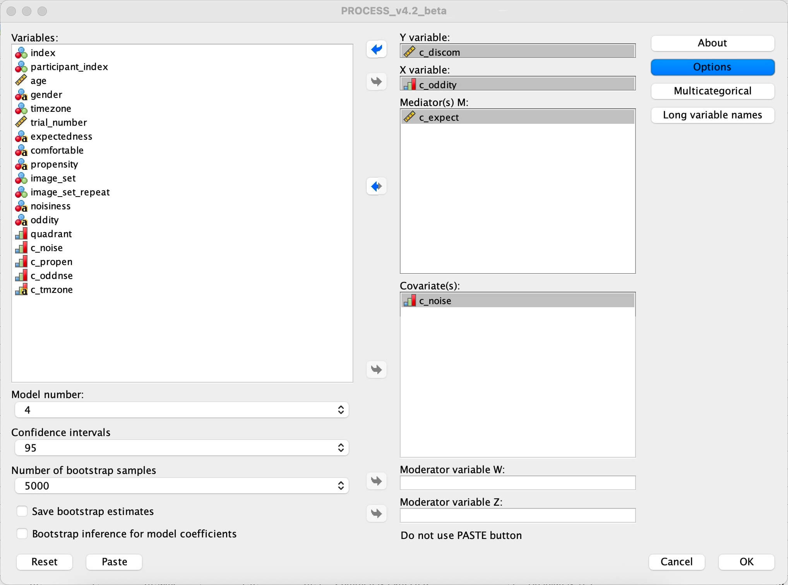
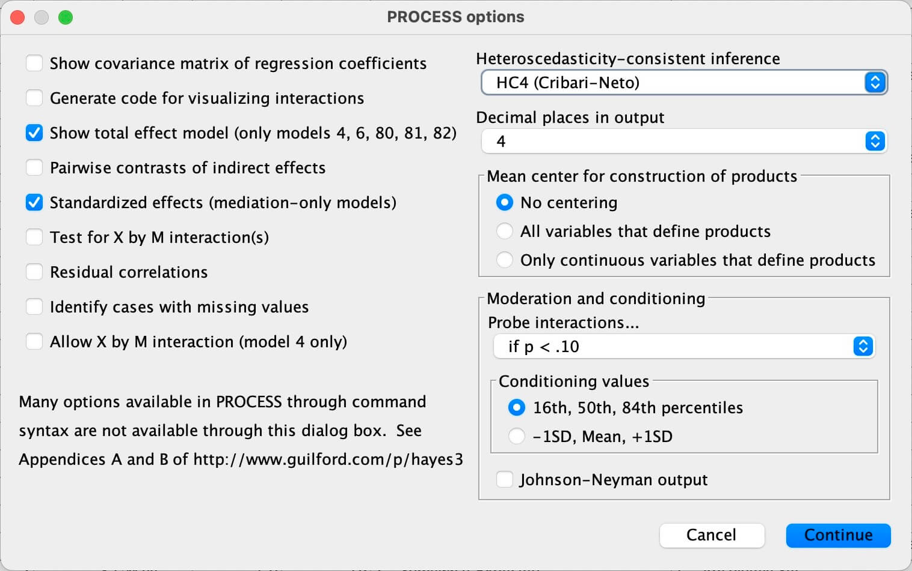
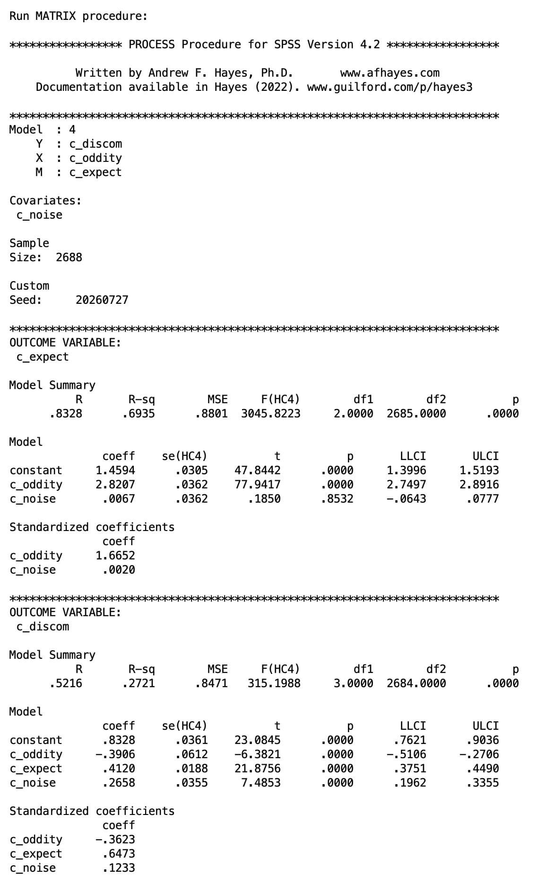
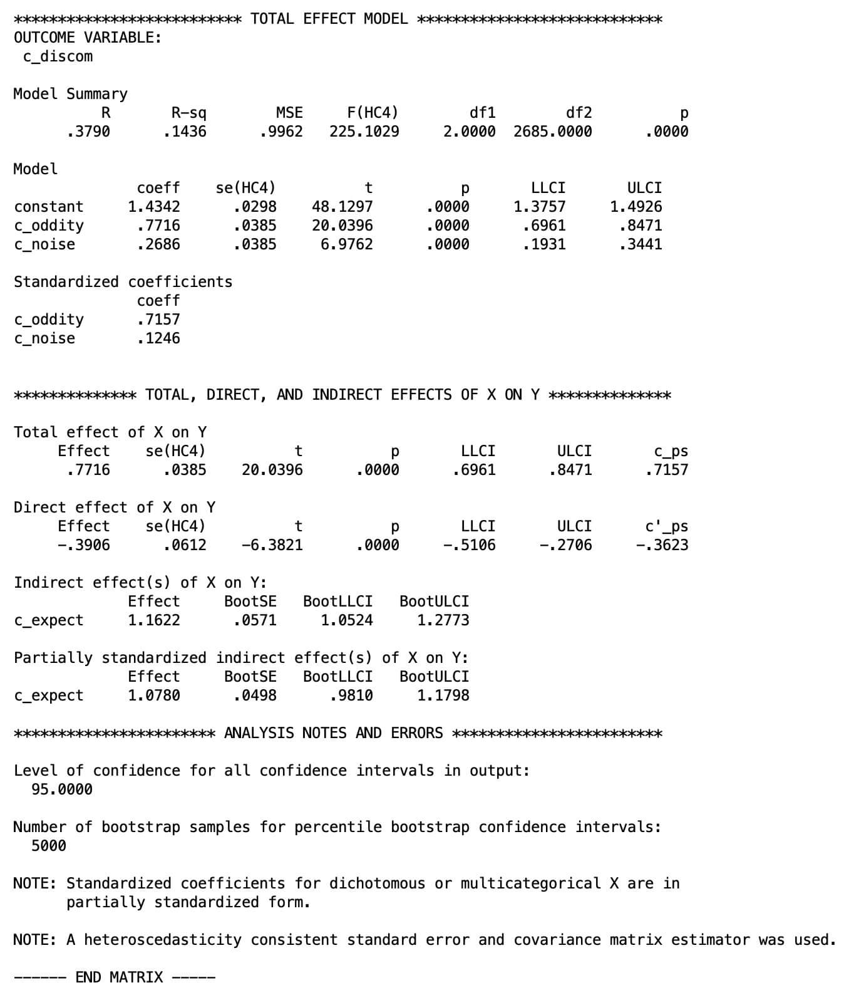
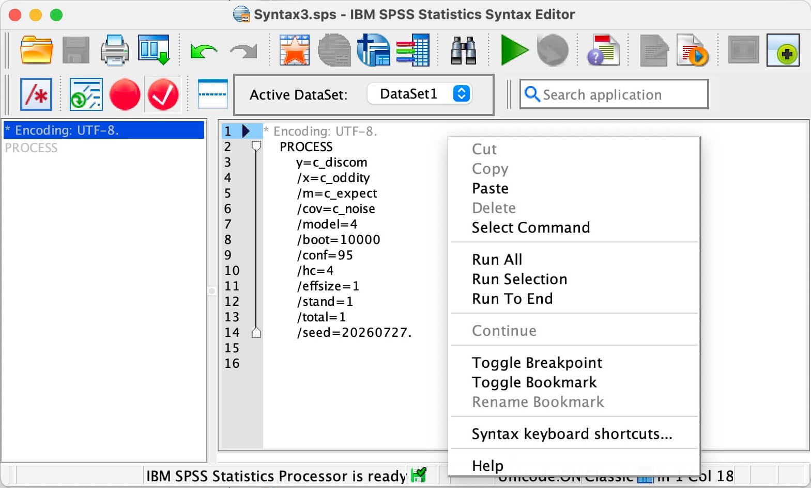
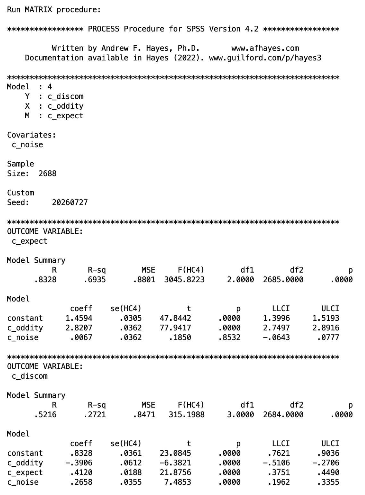

# IBM SPSS Statistics - Hypothesis 3 Statistics

> Version used: Version 31.0.1.0 (49)
>
> PROCESS Version used: v4.2_beta

---

> - **H3** **<u>Unexpectedness mediates</u>* - Oddity raises perceived unexpectedness, and unexpectedness carries the effect of oddity on comfort.
>
>     - PROCESS Model 4
>     - 10,000 bootstraps
>     - HC4

---

## The PROCESS regression

- Menu: `Analyze → Regression → PROCESS v4.2 by Andrew F. Hayes`

- In the dialog, select:
    - Y variable: `c_discom`
    - X variable: `c_oddity`
    - Mediator(s) M: `c_expect`
    - Covariate(s): `c_noise`
    - Model number: `4`
    - Confidence intervals: `95`
    - Number of bootstrap samples: `5000`

    

- Select the **Options** button:
    - Tick: 
        - Show total effect model... → *(Y on X without M)* → *needed for the total effect *c**
        - Standardized effects → *gives the completely standardised indirect effect as the effect size*
        - Heteroscedasticity-consistent inference → select **HC4 (Cribari-Neto)** from the dropdown

    

- Continue, & OK

---

## Results *(Part 1 - from PROCESS Dialog)*

- Output:
    
    
    

- **H3 is supported** - the indirect effect is large and its CI is nowhere near zero. But the direct effect flips sign, which is the interesting part and needs expanding on.

- **The paths**

    | Path | Effect | *SE*(HC4) | 95% CI | *t* | *p* |
    |---|---|---|---|---|---|
    | *a* (oddity → unexpectedness) | 2.821 | .036 | [2.750, 2.892] | 77.94 | <.001 |
    | *b* (unexpectedness → discomfort, controlling X) | 0.412 | .019 | [0.375, 0.449] | 21.88 | <.001 |
    | *c* (total) | 0.772 | .039 | [0.696, 0.847] | 20.04 | <.001 |
    | *c′* (direct) | **−0.391** | .061 | [−0.511, −0.271] | −6.38 | <.001 |
    | *a*×*b* (indirect) | **1.162** | .057 (BootSE) | [1.052, 1.277] | - | - |

    - Partially standardised indirect effect = 1.078, 95% CI [0.981, 1.180].
    - Model fit: M model *R*² = .694, *F*(2, 2685) = 3045.82, *p* < .001. Y model *R*² = .272, *F*(3, 2684) = 315.20, *p* < .001.

- ⚠️ ⚠️ ⚠️ ***HOWEVER*, running PROCESS 4.2 from the dialog randomises the random seed, so replication is not possible.** ⚠️ ⚠️ ⚠️

---

## The PROCESS regression *(replicable)*

- To run the regression in a replicable manner, one needs to run the macro with a random seed set - and this can only be done from the **syntax** command.

- Menu: `Window → Go to Designated Syntax Window`

- Paste the following syntax:

    ```txt
    PROCESS
        y=c_discom
        /x=c_oddity
        /m=c_expect
        /cov=c_noise
        /model=4
        /boot=10000
        /conf=95
        /hc=4
        /effsize=1
        /stand=1
        /total=1
        /seed=20260727.
    ```

- Then right-click and `Run All`

    

---

## Results *(Part 2 - from PROCESS Syntax command)*

- Output:
    
    
    

- Substantively identical. Every OLS estimate - *a*, *b*, *c*, *c′*, and all model summaries - is unchanged.

    Bootstrapping only affects the indirect-effect CI and made it reproducible, and 10,000 samples tightened the bootstrap slightly.

- **The paths**

    | Path | Effect | *SE*(HC4) | 95% CI | *t* | *p* |
    |---|---|---|---|---|---|
    | *a* (oddity → unexpectedness) | 2.8207 | .0362 | [2.7497, 2.8916] | 77.9417 | <.001 |
    | *b* (unexpectedness → discomfort, controlling X) | .4120 | .0188 | [.3751, .4490] | 21.8756 | <.001 |
    | *c* (total) | .7716 | .0385 | [.6961, .8471] | 20.0396 | <.001 |
    | *c′* (direct) | **−.3906** | .0612 | [−.5106, −.2706] | −6.3821 | <.001 |
    | *a*×*b* (indirect) | **1.1622** | .0560 (BootSE) | [1.0524, 1.2750] | - | - |

    - Partially standardised: total *c_ps* = .7157, direct *c′_ps* = −.3623, indirect = 1.0780, BootSE = .0488, 95% CI [.9837, 1.1751].
    - M model: *R*² = .6935, *F*(2, 2685) = 3045.8223, *p* < .001. Y model: *R*² = .2721, *F*(3, 2684) = 315.1988, *p* < .001. Total-effect model: *R*² = .1436, *F*(2, 2685) = 225.1029, *p* < .001.

- **What this shows**

    **H3 is supported** - the bootstrapped indirect effect is 1.1622, CI [1.0524, 1.2750], well clear of zero. Oddity raises perceived unexpectedness by 2.8207 points on the 5-point scale - 1.6652 *SD* of `c_expect`, derived - and each unit of unexpectedness adds 0.4120 to discomfort.

    The indirect effect (1.1622) exceeds the total effect (.7716), which forces the direct effect negative. This is **inconsistent mediation**: indirect and direct pathways run in opposite directions and partially cancel. Oddity's effect on discomfort travels through perceived unexpectedness, and holding unexpectedness constant, oddity is associated with *less* discomfort.

    Noise dissociates cleanly across the two models - significant on discomfort (*b* = .2658, *p* < .001) but null on unexpectedness (*b* = .0067, *p* = .8532). Activity level therefore acts on the outcome without touching the mediating construct.

    <!-- Two constraints on the write-up, unchanged: don't use partial/full mediation language (*c′* is significant and sign-reversed, so the vocabulary doesn't apply), and don't compute a proportion mediated (1.1622 ÷ .7716 = 1.5062, uninterpretable under sign reversal). Report the partially standardised indirect effect as the effect size, and amßend your plan's reference to the *completely* standardised version - PROCESS gives the partially standardised form because X is dichotomous, as the output note states. -->

<!--
**Draft**

> A simple mediation analysis (PROCESS Model 4; Hayes, 2022) tested whether perceived unexpectedness mediated the effect of oddity on discomfort, controlling for background activity, using 10,000 bootstrap samples, HC4 heteroscedasticity-consistent standard errors, and a fixed random seed (20260727). Oddity strongly increased perceived unexpectedness, *a* = 2.8207, 95% CI [2.7497, 2.8916], *t*(2685) = 77.9417, *p* < .001, and unexpectedness in turn predicted greater discomfort, *b* = .4120, 95% CI [.3751, .4490], *t*(2684) = 21.8756, *p* < .001. The bootstrapped indirect effect was significant, *ab* = 1.1622, BootSE = .0560, 95% CI [1.0524, 1.2750], supporting H3; the partially standardised indirect effect was 1.0780, 95% CI [.9837, 1.1751]. However, the direct effect was significant and negative, *c′* = −.3906, 95% CI [−.5106, −.2706], *t*(2684) = −6.3821, *p* < .001, despite a positive total effect, *c* = .7716, 95% CI [.6961, .8471], *t*(2685) = 20.0396, *p* < .001. This constitutes inconsistent mediation: the positive effect of oddity on discomfort is carried by perceived unexpectedness, while a countervailing negative direct pathway partially suppresses it. Background activity predicted discomfort in the outcome model, *b* = .2658, *p* < .001, but was unrelated to perceived unexpectedness, *b* = .0067, *p* = .8532.

-->
